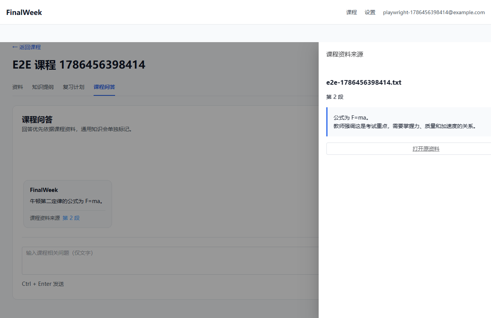
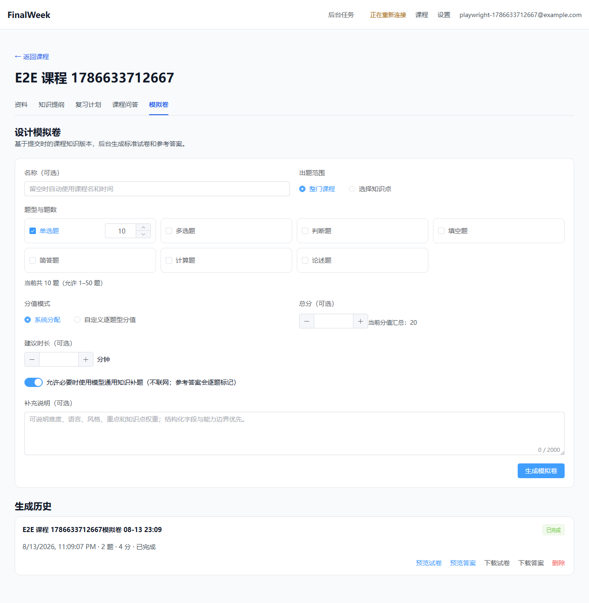
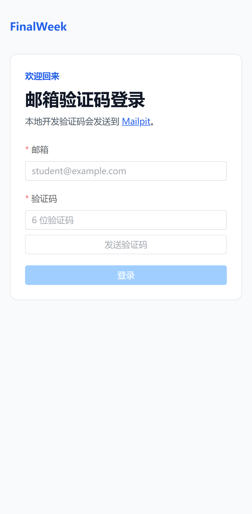

# FinalWeek

FinalWeek 是面向大学生期末复习的课程资料理解工具。项目按 [`docs/IMPLEMENTATION_PLAN.md`](docs/IMPLEMENTATION_PLAN.md) 串行开发；当前仓库已完成 Phase 1–16：可用 Docker Compose 本地运行“多资料 → 知识版本 → 自动提纲 → 异步计划/后台答疑 → 模拟卷双 PDF”的完整闭环。单元、容器、真实 XeLaTeX、浏览器 E2E 和扩展后的 14 条外部模型 Golden Case 均已实际运行。

## 当前可运行内容

- Vue 3.5 + Vite 8 + TypeScript 6 + Element Plus 前端，包含邮箱登录、课程列表、资料/知识提纲/复习计划/课程问答/模拟卷五区独立 URL、全局活动任务抽屉、设置页和手机基础布局。
- Java 21 + Spring Boot 3.5 单体，业务持久化采用 MyBatis-Plus、标量外键和显式 Mapper SQL；已实现 Mailpit 邮箱验证码、Redis TTL/限流、Spring Session、CSRF、课程 CRUD/逻辑删除、8 门上限和 ownership 隔离。
- Redis 故障门禁覆盖登录、全部认证接口和未来 AI API 路径，统一返回 `503 SERVICE_REDIS_UNAVAILABLE`；静态落地页及公开 ping 仍可访问。
- 前端支持同一资料类型下最多 50 份文件批量选择、3 文件并发和逐文件失败重试；分片上传使用 Redis 元数据/完成分片集合/完成标记、MinIO 确定性临时对象、Redisson complete 锁和 MySQL 唯一约束；支持断点差集续传、完整 SHA-256、格式/大小校验、同课程去重与过期临时分片清理。
- 上传完成会在同一数据库事务创建资料与 `PENDING_PUBLISH` 解析任务；RabbitMQ 使用 durable 队列、publisher confirm、manual ack、每轮三次投递预算和 DLQ，Redis/SSE 推送进度，MySQL REST 状态负责断线恢复。
- PDF 使用 PDFBox 按页提取并对低文字密度页 OCR；PPTX 使用 POI 按幻灯片提取、LibreOffice 生成确定性 PDF 预览，必要时逐页 OCR；TXT/MD 保留段落号。
- MP3/MP4 使用 FFmpeg/ffprobe 校验时长并生成整份单声道 WAV，`paraformer-realtime-v2` 通过 SDK 本地文件非流式调用识别并保存句级时间戳；MP4 按场景和最长间隔抽帧、感知哈希去重、OCR，并按时间线合并 ASR/OCR。单路失败时保留另一条有效内容并记录警告。
- `CourseSegment` 保存页码、幻灯片号、段落号或起止毫秒；语义优先的固定 token 上限分块保留来源位置，并以 `(material, chunk)` 生成稳定 UUID。任务依次持久化 `UPLOADED → CONTENT_EXTRACTED → CHUNKED → EMBEDDING_COMPLETED → COMPLETED` checkpoint，完整建索引后才原子标记资料成功。
- 百炼 `text-embedding-v4` 批量向量化后按稳定 segment UUID upsert Qdrant，并携带用户、课程、资料和 segment 隔离字段；Lucene 10 为每门课程维护 BM25 增量索引，同课程写入由本地锁和 Redisson 锁串行化，启动时可按 MySQL 成功资料核对并重建。
- 混合检索分别执行向量召回与 BM25，使用可配置 RRF（默认 `K=60`）融合、去重并回到 MySQL 解析原文；只返回 `SUCCEEDED` 资料，单路故障自动降级、双路故障明确返回不可用。
- “资料已上传完毕”会在课程锁内把当时全部成功资料固化为不可变知识版本；资料集合哈希阻止重复确认，失败/取消资料必须明确忽略。新版自动创建提纲任务，发布成功前旧知识版本与旧提纲保持可用，旧版本内部保留。
- 原 `parse_task` 数据经 Flyway 迁移为通用 `background_task`，统一承载资料、提纲、计划、模拟卷和隐藏答疑任务。任务类型约束各自 checkpoint，保留 publisher confirm、manual ack、旧执行轮次、CAS 执行租约、心跳续租、超时回收、取消竞争与 REST/SSE 恢复；全局抽屉只显示对用户可见的活动任务。
- 知识大纲以独立 RabbitMQ 任务执行，使用固定知识版本上下文和百炼 JSON 模式生成最多四层、100 节点的树；JSON Schema/Java 双重约束、一次格式修复、来源归属校验和版本 CAS 保证失败或旧任务不会覆盖当前大纲。人工重要度只修改当前版本，不跨版本继承。
- 复习计划使用考试日期、每日分钟数、整体掌握程度和目标成绩异步生成按日期排列的知识点任务；服务端校验节点、单日与总时间预算，支持完成和撤销完成。请求幂等、知识版本快照和当前计划版本 CAS 保证旧任务不能覆盖新计划，生成失败保留旧计划。
- 每门课程维护一条可游标翻页的连续文字问答历史。问题与隐藏后台任务在同一事务落库，答疑立即检索当前全部成功资料并允许离页；回答正文、课程来源与可选通用知识补充结构化分离。失败重试复用原消息 ID，不进入全局任务抽屉。
- 模拟卷固定提交时的知识版本和可选提纲子树，支持单选、多选、判断、填空、简答、计算、论述、综合八类题型、自动/自定义整数分值、可选总分/时长、严格资料模式和必要通用知识补题。Java 校验题量、答案、来源、公式及原题复刻，历史记录保留失败/取消与关联重试。
- 试卷和参考答案从同一份已校验 DTO 渲染。后端 Jammy 镜像内以非特权用户运行 XeLaTeX、Noto CJK、固定模板和 `-no-shell-escape`，执行 TeX 转义、公式白名单、超时/大小/PDFBox 校验；两份 PDF 均上传并复核后才原子发布，MinIO 对象删除使用可重试清理记录。
- PDF/PPTX 预览统一为短时授权 PDF URL；TXT/MD/MP3/MP4 使用原文件短时 URL，MinIO 支持浏览器 Range 请求。来源片段接口同时校验用户、课程和资料归属。
- 单个 Compose 项目启动前端、后端、MySQL、Redis、RabbitMQ、MinIO、Qdrant 和 Mailpit；Web API 与 MQ consumer 保持同一后端进程。
- 管理员跨存储核对命令以 MySQL 活跃课程、资料和 segment 为白名单，检查已删课程及孤儿 MinIO、Qdrant、Lucene 数据；默认只 dry-run。
- JUnit、Testcontainers、Vitest、Playwright、宿主机/容器内 XeLaTeX 与包含 6 条模拟卷场景的 14 案例真实模型评测均已实际运行。

## 架构基线

```text
Vue 3 -- REST / SSE / chunk upload --> Spring Boot (single JVM)
                                          |-- MySQL
                                          |-- Redis
                                          |-- RabbitMQ
                                          |-- MinIO
                                          |-- Qdrant
                                          |-- local Lucene (course BM25)
                                          `-- XeLaTeX + Noto CJK (two PDFs)
```

完整请求链路为：浏览器分片上传到 Spring Boot，原始资料进入 MinIO，业务与 checkpoint 写 MySQL；RabbitMQ 驱动同 JVM consumer 完成解析，Redis 承担 Session、进度、锁与限流，Qdrant + Lucene 提供课程隔离的混合检索。MySQL 始终是任务终态和业务结果真相源。

## 界面截图

真实 Playwright 流程生成，截图中的课程、资料、回答和引用均来自当次 E2E 数据。







## 一键启动

前置要求：Docker Desktop 与 Docker Compose v2。

```powershell
Copy-Item .env.example .env
docker compose up -d --build
docker compose ps
```

默认入口：

- 应用：http://localhost:5173
- 后端健康检查：http://localhost:8080/actuator/health
- OpenAPI UI：http://localhost:8080/swagger-ui.html
- RabbitMQ 管理页：http://localhost:15672
- MinIO 控制台：http://localhost:9001
- Mailpit：http://localhost:8025
- Qdrant：http://localhost:6333/dashboard

本地登录流程：打开应用后进入“邮箱验证码登录”，填写任意合法邮箱并发送验证码，再到 Mailpit 查看 6 位验证码。验证码默认 10 分钟有效，同一邮箱 60 秒内不可重复发送。

如果宿主机已有 MySQL 或 Redis，在 `.env` 中修改 `MYSQL_HOST_PORT`、`REDIS_HOST_PORT` 即可；容器间连接仍使用标准内部端口。

停止服务：

```powershell
docker compose down
```

该命令不会删除命名卷。只有明确需要丢弃本地数据时才使用 `docker compose down -v`。

## 开发模式

开发时可以只启动中间件，再在宿主机运行前后端。这是开发便利模式，不替代完整 Compose 交付。

```powershell
docker compose up -d mysql redis rabbitmq minio qdrant mailpit

Set-Location backend
.\mvnw.cmd spring-boot:run

Set-Location ..\frontend
corepack pnpm@10.18.3 install --frozen-lockfile
corepack pnpm@10.18.3 dev
```

宿主机后端连接非默认映射端口时，需要相应设置 `MYSQL_URL` 与 `REDIS_PORT`。

## 测试

```powershell
Set-Location backend
.\mvnw.cmd -B -ntp -s .mvn\settings.xml test

Set-Location ..\frontend
corepack pnpm@10.18.3 test
corepack pnpm@10.18.3 build
```

最新记录的 2026-08-24 宿主机完整后端回归执行 115 项 JUnit，0 failures、0 errors、1 skipped；新增综合题、分题型生成和失败题型局部重试覆盖。2026-08-21 的 105 项 MyBatis-Plus 重构基线、Docker 镜像构建、MySQL Testcontainers、真实 XeLaTeX、前端 Vitest/构建和 Playwright 结果作为历史环境证据保留在 [`docs/TEST_REPORT.md`](docs/TEST_REPORT.md)，不同日期与运行环境的测试数量不合并统计。

自动化测试在原有上传、解析、检索和权限覆盖基础上，增加知识版本集合幂等/失败资料忽略/版本化提纲、通用任务可见性与取消竞争、异步计划/答疑恢复、八类题型与整数溢出边界、严格资料/通用知识、来源与相似度策略、TeX 转义/公式白名单、双 PDF 原子发布、逻辑删除/对象清理和课程级清理。综合题已纳入自动化测试，但尚未重新运行付费 Golden Eval；历史 14 条真实报告只代表原七类题型。详见 [`docs/TEST_REPORT.md`](docs/TEST_REPORT.md)。

Phase 5 真实验证使用五种格式逐一走完登录、建课、分片上传、RabbitMQ 消费和来源读取：PDF/PPTX/TXT 生成正确页/幻灯片/段落位置，MP3 生成句级时间戳，MP4 以一次 ASR 和一次 OCR 合并音轨与画面文字；五种预览均验证 Range `206`，来源接口验证所属用户 `200`、其他用户 `404`、匿名 `401`。

Phase 6 真实验证使用无仓库信息的合成文本走完上传、分块、百炼 embedding、Qdrant 与 Lucene：任务以一次 API 调用成功，五个 checkpoint 顺序完整，Qdrant point ID 与 segment ID 相同且隔离 payload 完整，课程 Lucene 索引落盘。混合排序、单路降级、所有权过滤、重复 upsert、同课程并发写入和故障重建由自动化测试覆盖。

Phase 7 真实验证在同一合成课程上使用百炼 `qwen3.7-plus` 生成大纲：并发请求返回同一活动任务，任务一次调用成功并依次完成 `CONTEXT_RETRIEVED → OUTLINE_GENERATED → COMPLETED`；7 个节点均带有效来源。人工重要度跨刷新保留，其他用户修改返回 404；故意触发的持久化失败完整回滚并保留旧版本，修复后版本 3 原子替换版本 1，失败的版本 2 未覆盖数据，最终仅保留一份当前大纲且无活动任务。

Phase 8 的历史验证使用当前提纲和百炼 `qwen3.7-plus` 完成计划生成：首次生成 10 项、总计 300 分钟且单日不超过 60 分钟，同一幂等键重放直接返回版本 1；完成与撤销均持久化，其他用户修改返回 404。再次生成以 3 项、单日最多 45 分钟的版本 2 原子替换版本 1，旧完成状态被覆盖，数据库始终只有一份当前计划。Phase 13 已将该 HTTP 同步编排迁移为后台任务，业务约束保持不变。

Phase 9 真实验证使用同一合成课程走完混合检索和百炼 `qwen3.7-plus` 问答：问题与回答均为 `SUCCEEDED`，回答返回 1 个有效课程来源且未使用通用知识；历史接口连续返回 2 条消息，按原用户消息 ID 重试直接重放既有回答且不产生重复记录。来源归属读取为 `200`，另一账号读取课程历史和重试原消息均为 `404`；Redis fail-closed 路径及限流后不检索、不调用模型由自动化测试覆盖。

Phase 10 提供 8 个固定 Golden Case，覆盖原生 PDF、扫描 PDF、PPTX、音频、音视频互补、真题重点、可回答问题和不可回答问题。固定输入是 Phase 5 抽取结果的版本化快照，启动评测前逐一校验 SHA-256；案例、人工标注、输入清单和报告 Schema 分别位于 `evals/cases`、`evals/annotations`、`evals/fixtures` 和 `evals/report.schema.json`。

Phase 12–16 把 Golden Case 扩展到 14 条，新增真题风格、教师例题、严格资料不足、通用知识补题、七类题型和公式/答案一致性场景，并在报告 Schema 中分别记录结构合法性、来源忠实度、答案一致性、源题复刻率和 PDF 可用性。2026-08-13 的真实扩展报告为 [`evals/reports/golden-20260813-150557.json`](evals/reports/golden-20260813-150557.json)：14/14 案例无执行失败，overall `passed`；覆盖率、引用正确率、结构合法性、来源忠实度、答案一致性和 PDF 可用性均为 `100%`，未标记无依据陈述比例与源题复刻率均为 `0%`，重要度一致率为 `50%`。

2026-08-11 使用真实 `qwen3.7-plus` 运行的首份报告为 [`evals/reports/golden-20260811-130019.json`](evals/reports/golden-20260811-130019.json)：8/8 案例无执行失败，核心知识点覆盖率 `100%`、引用正确率 `100%`、未标记无依据陈述比例 `0%`，达到默认 `80% / 90% / 10%` 阈值。重要度一致率只有 `33.3%`：模型把四个没有教师强调或真题信号的顶层概念判为高，而人工标注为中；这项当前没有通过阈值，报告保留原始输出，后续应通过更明确的重要度评分规则而不是修改结果来掩盖差异。

运行真实评测（会读取仓库根目录忽略提交的 `.env`，调用模型并覆盖 `latest.json`）：

```powershell
Set-Location backend
.\mvnw.cmd -Pgolden-eval verify
```

运行浏览器 E2E（需要 Playwright Chromium；Edge 使用系统安装）：

```powershell
Set-Location frontend
corepack pnpm@10.18.3 install --frozen-lockfile
.\node_modules\.bin\playwright.CMD install chromium
.\node_modules\.bin\playwright.CMD test
```

## 管理员清理核对

命令默认 dry-run；下面的显式参数也只统计，不删除数据：

```powershell
docker compose run --rm backend --finalweek.cleanup.enabled=true --finalweek.cleanup.dry-run=true
```

只有显式传入 `--finalweek.cleanup.dry-run=false` 才会删除跨存储孤儿数据。执行真实删除前应先备份并人工审阅 dry-run 统计；本项目不把该本地命令描述为生产级合规清除。

## 已知边界

- 这是单用户隔离、本地演示取向的求职 MVP，没有公网流量、生产 SLA、压测结论、自动备份或告警数据。
- 后端只支持单实例；Lucene 是本地可重建索引，不能据此横向扩容。
- 仅接入百炼，不包含多模型路由、联网搜索、复杂 Agent 或 Cross-Encoder 重排。
- OCR/ASR 不承诺识别潦草手写、复杂公式/图表、纯视觉动作；模拟卷首版不生成依赖图片、图表或复杂视觉公式的题目。
- 不包含在线答题、自动评分、倒计时、错题本、公开分享、在线编辑、联网检索或图像题。最新 14 条 Golden Case 的重要度一致率为 `50%`；该指标当前仅用于观察，尚未设置通过阈值。
- 删除采用逻辑删除加管理员异步核对，不提供回收站，也不承诺立即完成生产级跨存储清除。
- 限流、超时、TopK 等值是可配置的本地默认值，未经真实生产流量验证。

## 配置与密钥

首版所有数量、大小、TTL、限流、TopK、RRF、任务/模型/PDF 超时、历史条数、XeLaTeX 路径、模板/质量策略版本与模型 ID 都集中在类型化后端配置和 [`.env.example`](.env.example) 中。不要提交 `.env` 或真实 `BAILIAN_API_KEY`。

## 规范

产品范围、技术选型、交互流程、后端约束、前端规范和阶段计划均在 [`docs`](docs) 目录。实现发生冲突时，以六份规范文档的共同约束和 `IMPLEMENTATION_PLAN` 阶段顺序为准。
